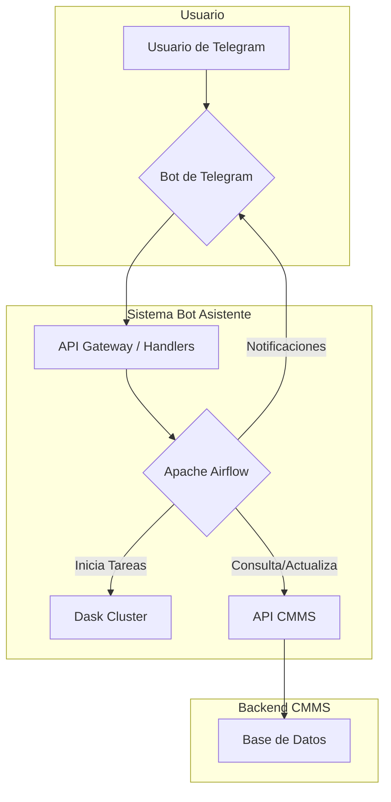

'''
# Bot Asistente CMMS con Apache Airflow y Dask

Este directorio contiene la implementación de un bot asistente inteligente para el sistema **Somacor CMMS v2**. El bot utiliza **Apache Airflow** para orquestar flujos de trabajo de mantenimiento, **Dask** para análisis de datos y procesamiento distribuido, y se integra con **Telegram** para notificaciones y comandos interactivos.

## 1. Arquitectura General

El sistema se compone de los siguientes elementos principales:

- **Apache Airflow**: Orquesta los flujos de trabajo (DAGs) para análisis predictivo, mantenimiento preventivo, procesamiento de checklists y generación de reportes.
- **Dask Cluster**: Proporciona capacidades de procesamiento paralelo para análisis de grandes volúmenes de datos y entrenamiento de modelos de Machine Learning.
- **Bot de Telegram**: Actúa como interfaz de usuario para notificaciones y comandos interactivos, permitiendo a los usuarios consultar información y recibir alertas.
- **API del CMMS**: El bot interactúa con la API existente del backend de Django para obtener datos y ejecutar acciones (ej. crear órdenes de trabajo).
- **Modelos de Machine Learning**: Se entrenan modelos para predecir fallas de equipos, priorizar órdenes de trabajo y optimizar la asignación de recursos.



## 2. Estructura de Directorios

```
airflow_bot/
├── dags/                  # Definiciones de DAGs de Airflow
│   ├── dag_analisis_predictivo.py
│   ├── dag_mantenimiento_preventivo.py
│   └── dag_procesamiento_checklists.py
├── scripts/               # Scripts y utilidades
│   └── cmms_api_client.py
├── config/                # Módulos de configuración
│   └── airflow_config.py
├── logs/                  # Logs de ejecución
├── plugins/               # Plugins personalizados de Airflow
├── requirements.txt       # Dependencias de Python
├── .env.example           # Archivo de ejemplo para variables de entorno
├── setup.sh               # Script de instalación y configuración
└── README.md              # Esta documentación
```

## 3. DAGs Implementados

### 3.1. Análisis Predictivo de Fallas (`analisis_predictivo_fallas`)

- **Schedule**: Diario (`0 2 * * *`).
- **Objetivo**: Analizar el historial de fallas para predecir qué equipos tienen una alta probabilidad de fallar en el futuro cercano.
- **Flujo de Trabajo**:
  1.  **Extraer Datos**: Obtiene datos de equipos y órdenes de trabajo desde la API del CMMS.
  2.  **Calcular Métricas**: Calcula MTBF (Mean Time Between Failures) y MTTR (Mean Time To Repair) para cada equipo.
  3.  **Predecir Fallas**: Utiliza un modelo de Machine Learning (o una heurística) para calcular la probabilidad de falla.
  4.  **Generar Alertas**: Crea alertas para los equipos que superan un umbral de riesgo.
  5.  **Crear Órdenes**: Genera automáticamente órdenes de trabajo preventivas para los equipos en mayor riesgo.
  6.  **Notificar**: Envía un resumen de las alertas y acciones a los administradores vía Telegram.

### 3.2. Mantenimiento Preventivo Semanal (`mantenimiento_preventivo_semanal`)

- **Schedule**: Semanal (`0 3 * * 1`).
- **Objetivo**: Automatizar la creación de órdenes de trabajo para mantenimientos preventivos programados.
- **Flujo de Trabajo**:
  1.  **Obtener Planes**: Carga los planes de mantenimiento preventivo activos.
  2.  **Calcular Próximas Fechas**: Determina qué equipos requieren mantenimiento en la próxima semana.
  3.  **Asignar Técnicos**: Asigna las tareas a los técnicos disponibles, balanceando la carga de trabajo.
  4.  **Crear Órdenes**: Genera las órdenes de trabajo preventivas en el sistema CMMS.
  5.  **Notificar**: Informa a los técnicos sobre sus nuevas asignaciones.

### 3.3. Procesamiento Diario de Checklists (`procesamiento_checklists_diario`)

- **Schedule**: Diario (`0 1 * * *`).
- **Objetivo**: Analizar los checklists completados el día anterior para detectar problemas y generar acciones correctivas.
- **Flujo de Trabajo**:
  1.  **Obtener Checklists**: Carga los checklists completados en las últimas 24 horas.
  2.  **Analizar Items**: Identifica items marcados como "fallidos", especialmente los críticos.
  3.  **Crear Órdenes**: Genera automáticamente órdenes de trabajo correctivas para los problemas críticos detectados.
  4.  **Analizar Patrones**: Identifica los items que fallan con más frecuencia y los equipos más afectados.
  5.  **Notificar**: Envía un resumen a los supervisores con los hallazgos y las acciones tomadas.

## 4. Configuración e Instalación

Para instalar y configurar el sistema del bot, sigue estos pasos:

1.  **Clonar el Repositorio**: Si aún no lo has hecho, clona el repositorio completo:
    ```bash
    git clone https://github.com/matiasmoralesa/cmms-somacorv2.git
    cd cmms-somacorv2
    ```

2.  **Ejecutar el Script de Setup**:
    El script `setup.sh` se encargará de crear el entorno virtual, instalar dependencias, configurar Airflow y crear los scripts de inicio.
    ```bash
    cd airflow_bot
    chmod +x setup.sh
    ./setup.sh
    ```

3.  **Configurar Variables de Entorno**:
    Edita el archivo `.env` que se creó en el directorio `airflow_bot/` y añade tus tokens y configuraciones personalizadas.
    ```bash
    nano airflow_bot/.env
    ```
    Asegúrate de configurar:
    - `TELEGRAM_BOT_TOKEN`: El token de tu bot de Telegram.
    - `CMMS_API_BASE_URL`: La URL del backend de Django.
    - `CMMS_API_TOKEN`: Un token de autenticación para la API (si es necesario).
    - `DATABASE_...`: La configuración de la base de datos que usará Airflow.

## 5. Cómo Ejecutar el Sistema

El script de setup crea scripts maestros para facilitar el inicio y la detención de todos los componentes del sistema.

-   **Para iniciar todo el sistema (Dask, Airflow, Telegram Bot)**:
    ```bash
    ./start_bot_system.sh
    ```

-   **Para detener todo el sistema**:
    ```bash
    ./stop_bot_system.sh
    ```

### Servicios Disponibles

-   **Airflow Web UI**: `http://localhost:8080`
    -   **Usuario**: `admin`
    -   **Contraseña**: `admin123` (puedes cambiarla en Airflow).
-   **Dask Dashboard**: `http://localhost:8787`
-   **Bot de Telegram**: Estará activo y respondiendo a comandos.

## 6. Machine Learning

El sistema está preparado para integrar modelos de Machine Learning entrenados para la predicción de fallas. El script `ml_models/training/failure_prediction_model.py` contiene la lógica para:

1.  **Extracción de Features**: Crea características a partir del historial de un equipo (ej. MTBF, MTTR, edad, frecuencia de fallas).
2.  **Creación de Target**: Define la variable objetivo (ej. si un equipo fallará en los próximos 30 días).
3.  **Entrenamiento**: Entrena un modelo (ej. `RandomForestClassifier`) con los datos preparados.
4.  **Evaluación**: Mide el rendimiento del modelo con métricas como Accuracy y ROC-AUC.
5.  **Serialización**: Guarda el modelo entrenado y el pre-procesador (`StandardScaler`) para su uso en producción.

Para entrenar el modelo, ejecuta:

```bash
source airflow_bot/venv/bin/activate
python ml_models/training/failure_prediction_model.py
```

El modelo entrenado se guardará en `ml_models/models/` y será cargado por el DAG de análisis predictivo para realizar inferencias.
'''
